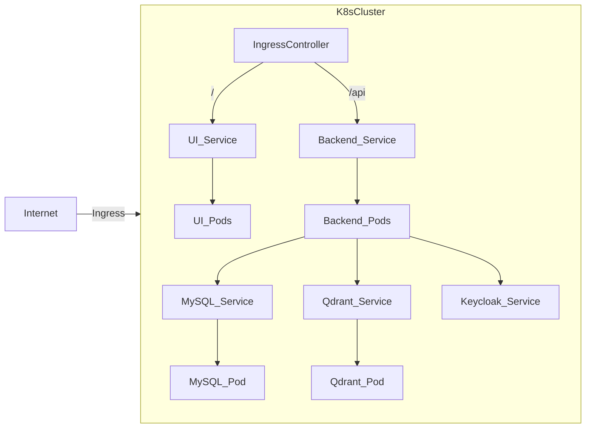

# AKS Deployment for Essedum Platform

This directory contains the Kubernetes manifests and Helm charts for deploying the Essedum platform on Azure Kubernetes Service (AKS).

## Design and Architecture

The deployment follows a standard microservices pattern on Kubernetes.

### Components

*   **Ingress (`ingress.yaml`, `ingress-nginx-deploy.yaml`)**:
    *   **Role**: Acts as the entry point for external traffic. Routes traffic to `frontend` (UI) and `backend` services based on paths/hostnames.
    *   **Configuration**: SSL termination is typically handled here or at the load balancer level.

*   **Backend (`essedum-backend.yaml`)**:
    *   **Role**: Spring Boot application.
    *   **Scaling**: Scaled via HPA (`essedum-backend-hpa.yaml`) based on CPU/Memory usage.
    *   **Dependencies**: Connects to MySQL and Qdrant.

*   **Frontend (`essedum-ui.yaml`)**:
    *   **Role**: Nginx serving Angular static files.
    *   **Scaling**: Scaled via HPA (`essedum-ui-hpa.yaml`).

*   **Executors**:
    *   `pyjob-executor.yaml`: Python job runner. Scaled via HPA.
    *   Cloud-specific executors (Azure, SageMaker, Vertex) can be deployed similarly if containerized images are available.

*   **Data Stores**:
    *   **MySQL (`mysql_deployment_v3.yaml`)**: Relational DB. Uses PVC (`mysql_file_pv.yaml`) for persistence.
    *   **Qdrant (`qdrant_deployment.yaml`)**: Vector DB. Uses PVC (`qdrantfilepv.yaml`) for persistence.

*   **Identity**:
    *   **Keycloak (`keycloak_deployment.yaml`)**: IAM provider. Uses its own DB (or shares MySQL) and scales via HPA.

### Architecture Diagram

## Scaling

Autoscaling is configured using Horizontal Pod Autoscalers (HPA) for:
*   Backend
*   Frontend
*   Keycloak
*   Python Job Executor

Ensure metrics server is enabled in the cluster for HPA to function.
