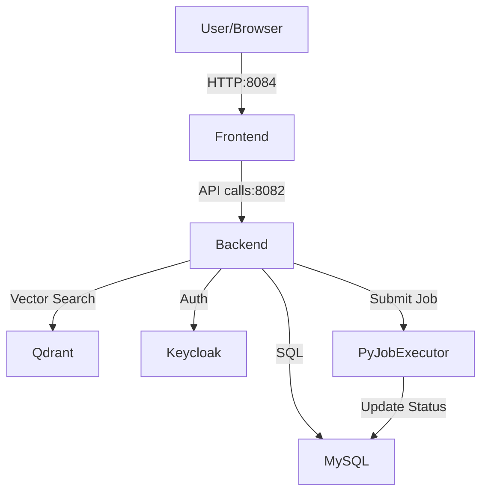

# Docker Setup for Essedum Platform

This directory contains the Docker Compose configuration to deploy the Essedum platform.

## Design and Architecture

The Essedum platform is containerized using Docker to ensure consistent deployment across environments. The `docker-compose.yml` file orchestrates the following services:

### Core Services
*   **Frontend (`frontend`)**:
    *   **Source**: `../essedum-ui`
    *   **Role**: Serves the Angular-based UI applications (`aip-app-ui` and `shell-app-ui`) via Nginx.
    *   **Port**: 8084

*   **Backend (`leap-app-backend-service`)**:
    *   **Source**: `../sv`
    *   **Role**: Spring Boot application acting as the core API server. Handles business logic, database interactions, and orchestrates job submission.
    *   **Port**: 8082
    *   **Dependencies**: MySQL, Qdrant, Keycloak.

### Infrastructure Services
*   **MySQL (`mysql`)**:
    *   **Role**: Primary relational database for the platform.
    *   **Initialization**: Scripts in `mysql-init/` initialize the schema on first run.
    *   **Port**: 3306

*   **Qdrant (`qdrant`)**:
    *   **Role**: Vector database used for RAG (Retrieval-Augmented Generation) and AI memory features.
    *   **Port**: 6333

*   **Keycloak (`keycloak`)**:
    *   **Role**: Identity and Access Management (IAM). Handles user authentication and OIDC/OAuth2 flows.
    *   **Port**: 8180

### Job Executors
*   **Python Job Executor (`py-job-executor`)**:
    *   **Source**: `../py-job-executer`
    *   **Role**: Executes general Python tasks. It polls the database or receives requests to run Python scripts locally within the container.
    *   **Port**: 5000

## Architecture Diagram



## Running the Platform

1.  **Configure Environment**:
    Copy `.env.sample` to `.env` and update values if necessary.
    ```bash
    cp .env.sample .env
    ```

2.  **Start Services**:
    ```bash
    docker-compose up --build -d
    ```

3.  **Access**:
    *   UI: http://localhost:8084
    *   Backend API: http://localhost:8082
    *   Keycloak: http://localhost:8180
