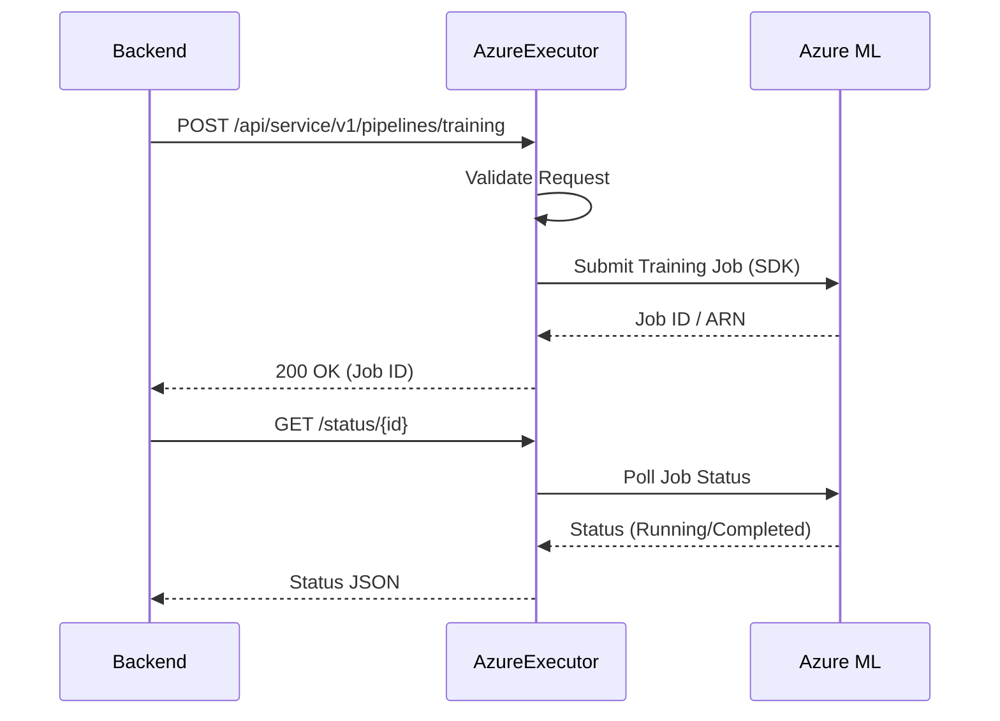

# Azure Job Executor

This component is responsible for executing machine learning pipelines on Microsoft Azure. It listens for job requests from the Essedum backend and orchestrates the execution on Azure services.

## Setup Instructions

Steps to follow for the setup of the Azure executor:

1.  **Prerequisites**:
    -   Python 3.12 or higher installed.
    -   Azure CLI installed and authenticated.
    -   Appropriate Azure permissions for creating and managing resources.

2.  **Installation**:
    -   Create a virtual environment:
        ```bash
        python -m venv venv
        source venv/bin/activate  # On Windows: venv\Scripts\activate
        ```
    -   Install dependencies:
        ```bash
        pip install -r requirements.txt
        ```

3.  **Running the Service**:
    -   Run the application:
        ```bash
        python app.py
        ```
    -   The service will start on the configured port. Ensure the port is accessible if the backend is running on a different machine.

4.  **Service Management**:
    -   On Windows, you can use NSSM to run this as a service.
    -   On Linux, consider creating a Systemd service file.

## Design and Architecture

The Azure Job Executor is designed as a lightweight microservice that bridges Essedum with Azure cloud services.

### Architecture Overview

1.  **Flask API**: Exposes REST endpoints for the Backend to submit jobs and query status.
2.  **Job Queue**: Uses an internal queue (`Queue.py`) and a ThreadPoolExecutor to handle job submissions asynchronously without blocking the API.
3.  **Local Persistence**: Uses SQLite (`db.py`) to track the state of jobs (SUBMITTED, RUNNING, COMPLETED, ERROR) locally within the pod/container.
4.  **MLOps Adapter (`mlops/azure.py`)**: Contains the business logic to communicate with Azure. It handles:
    *   Dataset creation/management.
    *   Model registration and deployment.
    *   Training pipeline submission (AutoML).
    *   Inference execution.

### Azure Interaction Flow


