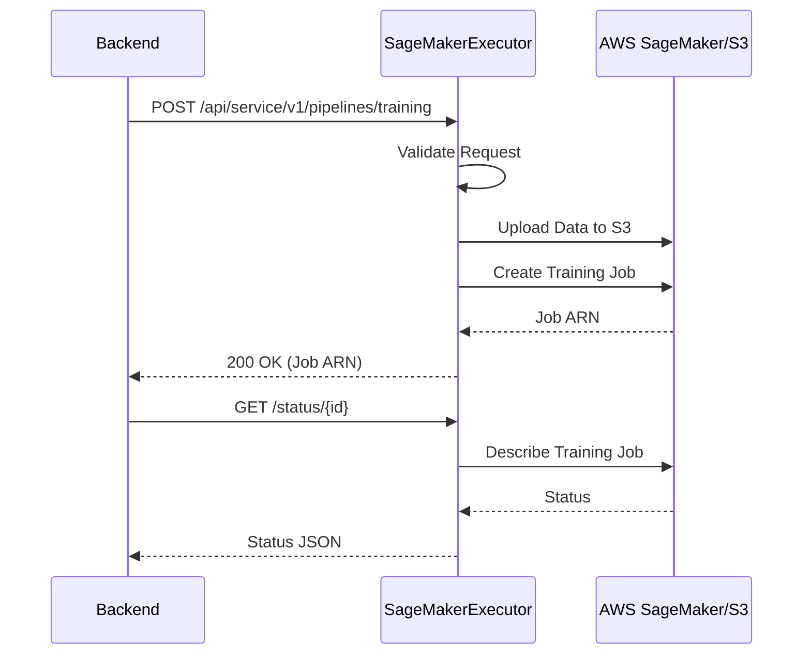

# AWS SageMaker Job Executor

This component is responsible for executing machine learning pipelines on AWS SageMaker. It listens for job requests from the Essedum backend and orchestrates the execution on the SageMaker platform.

## Setup Instructions

Steps to follow for the setup of the SageMaker executor:

1.  **Prerequisites**:
    -   Python 3.12 or higher installed.
    -   AWS Credentials configured with permissions to access SageMaker and S3.

2.  **Installation**:
    -   Create a virtual environment:
        ```bash
        python -m venv venv
        source venv/bin/activate  # On Windows: venv\Scripts\activate
        ```
    -   Install dependencies:
        ```bash
        pip install -r requirements.txt
        ```

3.  **Running the Service**:
    -   Run the application:
        ```bash
        python app.py
        ```
    -   The service will start on the configured port. Ensure the port is accessible if the backend is running on a different machine.

4.  **Service Management**:
    -   On Windows, you can use NSSM to run this as a service.
    -   On Linux, consider creating a Systemd service file.

## Design and Architecture

The SageMaker Job Executor acts as a bridge between the Essedum platform and AWS.

### Architecture Overview

1.  **Flask API**: Exposes REST endpoints compatible with the Essedum backend.
2.  **Job Queue**: Internal `Queue.py` manages asynchronous task execution.
3.  **Local Persistence**: SQLite (`db.py`) stores job metadata and status.
4.  **MLOps Adapter (`mlops/aws.py`)**:
    *   **S3 Integration**: Uploads/Downloads datasets and models.
    *   **SageMaker Training**: Submits training jobs (including AutoML) using `boto3` or SageMaker SDK.
    *   **Inference**: Deploys endpoints and invokes them for predictions.

### AWS Interaction Flow


