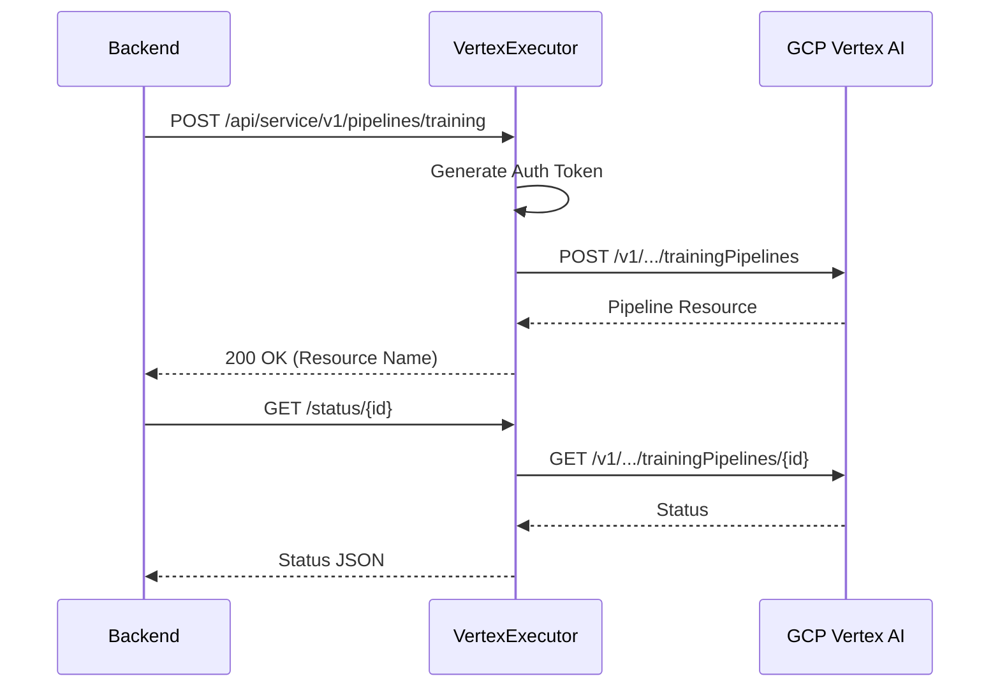

# GCP Vertex AI Job Executor

This component is responsible for executing machine learning pipelines on Google Cloud Platform (GCP) Vertex AI. It listens for job requests from the Essedum backend and orchestrates the execution on Vertex AI.

## Setup Instructions

Steps to follow for the setup of the Vertex AI executor:

1.  **Prerequisites**:
    -   Python 3.12 or higher installed.
    -   Google Cloud SDK installed and authenticated.
    -   Appropriate IAM permissions for Vertex AI and Cloud Storage.

2.  **Installation**:
    -   Create a virtual environment:
        ```bash
        python -m venv venv
        source venv/bin/activate  # On Windows: venv\Scripts\activate
        ```
    -   Install dependencies:
        ```bash
        pip install -r requirements.txt
        ```

3.  **Running the Service**:
    -   Run the application:
        ```bash
        python app.py
        ```
    -   The service will start on the configured port. Ensure the port is accessible if the backend is running on a different machine.

4.  **Service Management**:
    -   On Windows, you can use NSSM to run this as a service.
    -   On Linux, consider creating a Systemd service file.

## Design and Architecture

The Vertex AI Job Executor connects Essedum with Google Cloud Platform.

### Architecture Overview

1.  **Flask API**: Exposes REST endpoints compatible with the Essedum backend.
2.  **Job Queue**: Internal `Queue.py` manages asynchronous task execution.
3.  **Local Persistence**: SQLite (`db.py`) stores job metadata and status.
4.  **MLOps Adapter (`mlops/vertex.py`)**:
    *   **GCS Integration**: Uploads/Downloads datasets.
    *   **Vertex AI Training**: Submits custom training jobs and AutoML pipelines via REST API.
    *   **Vertex AI Prediction**: Deploys models to endpoints and handles batch/online prediction.

### GCP Interaction Flow


