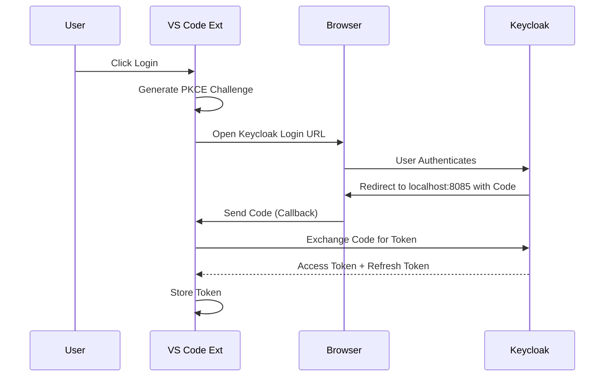

# Essedum AI Platform Extension for VS Code

This extension integrates VS Code with the Essedum AI Platform, providing seamless authentication and pipeline execution capabilities with enhanced OAuth 2.0 security.

## ✨ Features

- **🔐 Automatic OAuth 2.0 Authentication**: Secure, one-click authentication with PKCE support - no more manual token copying!
- **🚀 Pipeline Execution**: Submit and run scripts directly from VS Code on Essedum pipelines
- **📊 Real-time Monitoring**: View execution results, logs, and status in an integrated sidebar
- **🎨 Modern UI**: Clean, VS Code-themed interface with loading indicators and comprehensive error handling
- **🔄 Automatic Token Refresh**: Seamless token management with automatic renewal
- **⚙️ Configurable Settings**: Customizable OAuth server port and authentication options

## Requirements

- Visual Studio Code version 1.103.0 or higher
- Active Essedum AI Platform account
- Network access to the Essedum AI Platform server (https://aiplatform.az.ad.idemo-ppc.com:8443)
- Available port 8085 (configurable) for OAuth callback server

## Installation

1. Install the extension via VS Code Extensions Marketplace
2. Reload VS Code
3. The Essedum icon will appear in the Activity Bar

## Design and Architecture

The extension acts as a client for the Essedum Platform.

### Architecture Overview

1.  **Extension Host**: Runs in the VS Code process.
    *   **Sidebar Provider**: Renders the UI for managing platform resources.
    *   **Command Palette**: Exposes commands for quick access.
2.  **Authentication Module**:
    *   Implements PKCE (Proof Key for Code Exchange) flow.
    *   Launches system browser for login.
    *   Listens on a local port for the callback code.
3.  **API Client**:
    *   Communicates with the Essedum Backend (e.g., `https://aiplatform...`).
    *   Attaches Bearer tokens to requests.

### Authentication Flow

